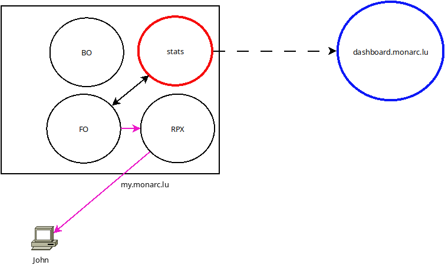
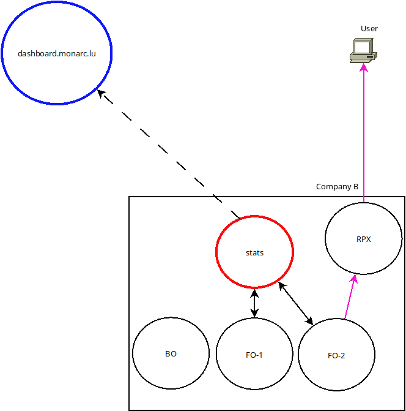
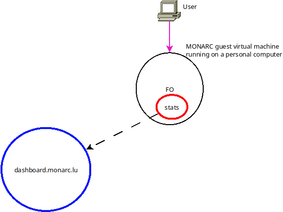

Architecture
============

These architecture diagrams presents the idea behind the decentralized nature
of the Stats Service API.


Scenario 1
----------



The Stats Service is installed on a dedicated server, gathering stats sent by the
front office (FO). It can also return the aggregated stats to the MONARC backend (FO)
for the dashboard of the MONARC users (with the CEO role).

The stats collection (from the FO to the stats node) can be triggered with a cron
task.

Scenario 2
----------



In the company A, the difference is that Stats Service API (*stats*) is
installed on the same server where the MONARC back office is deployed. Not on
on a dedicated server. The server hosting the back office of MONARC is a good choice.


Scenario 3
----------



*stats* collects data from the two MONARC front offices of the company B.
These aggregated data can be used for the dashboard for the CEO role of MONARC
client instances in this company. But also, in the future, for the MONARC back office.

     
Scenario 4
----------

.. image:: _static/architecture-stats-scenario4.png
   :alt: Stats Service API interaction with MONARC

Wendy is simply connected to a MONARC front office deployed in a local
Virtual Box instance. Stats Service (*stats*) is running next to MONARC in this virtual
machine.


.. note::

    Locally collected statistics (in *stats*)
    can optionally be sent to `dashboard.monarc.lu <https://dashboard.monarc.lu>`_ which is
    a global instance. It's the same software.


Integration with external services
----------------------------------

MOSP
````

A Stats Service instance is able to query MOSP.
