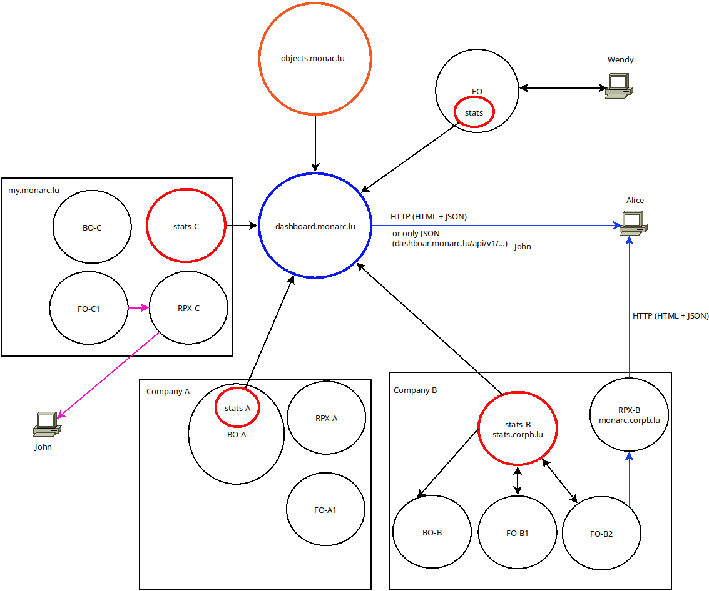

Architecture
============

This architecture diagram presents the idea behind the decentralized nature
of the stats service API. It looks a bit complicated but the goal is to gather
and explain different scenario.

As you can see several instances of Stats service are represented with red
circles:

- stats;
- stats-A;
- stats-B;
- stats-C, and finally in blue:
- dashboard.monarc.lu (which could be merged with stats-C).

*stats-B* collects data from the two MONARC front offices of the company B.
These aggregated data can be used for the dashboard for the CEO role of MONARC
client instances in this company. But also for the MONARC back office.
Optionally, *stats-B* can send statistics to dashboard.monarc.lu which is as well
a stats service API instance.

In the company A, the difference is that Stats Service API (*stats-A*) is
installed on the same server where the MONARC back office is deployed. Not on
on a dedicated server.

Wendy is simply connected to a MONARC front office deployed in a local
Virtual Box instance. Stats Service (*stats*) is running next to MONARC in this virtual
machine. Locally collected statistics can optionally be sent to
dashboard.monarc.lu.

A Stats service instance is able to query MOSP. This is reprensented with the
link between objects.monarc.lu and dashboard.monarc.lu.
