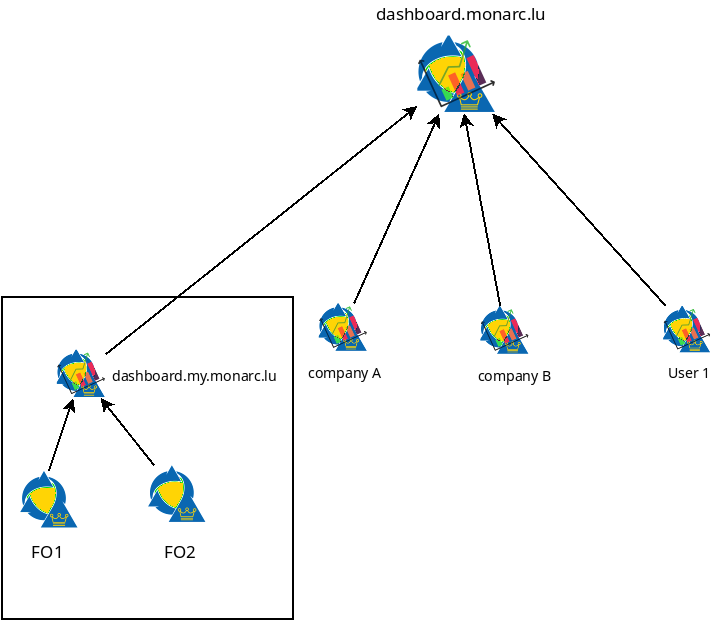

Architecture
============

High level architecture 
-----------------------

MONARC clients hosted on FO1 and FO2 push regularly stats about risk analysis to
a local Stats Service instance (dashboard.my.monarc.lu). This local Stats Service
instance provides the required functionalities for the Global Dashboard of the MONARC
clients. This step is the **collection of stats** and is local.

.. note::

    The collection of stats can be disabled per analysis.

The next step is the **sharing of stats**. Indeed, a company has the possibility to
`push stats <command-line-interface.html#pushing-data>`_
from the local Stats Service to, for example, dashboard.monarc.lu.

.. note::

    The sharing of stats can be disabled per client.

The service behind dashboard.monarc.lu is operated by CASES Luxembourg and aims to
provide relevant data about the current cybersecurity trends, focused in the Luxembourg area.

Examples
--------

The following diagrams presents the idea behind the decentralized nature of
i Stats Service.

Scenario 1
''''''''''

.. image:: _static/architecture-stats-scenario1.png
   :alt: Stats Service API interaction with MONARC

The Stats Service API (*stats*) is installed on the same server where the MONARC back
office is deployed. Not on on a dedicated server. The server hosting the back office of
MONARC is a good choice.

.. note::

    The Stats Service only communicates with the backend of MONARC thanks to
    :doc:`its API <./api-v1>`.

The stats collection (from the FO to the stats node) can be triggered with a
`cron job <installation.html#integration-with-monarc-and-collect-of-the-stats>`__.

Scenario 2
''''''''''

.. image:: _static/architecture-stats-scenario2.png
   :alt: Stats Service API interaction with MONARC

The Stats Service is installed on a dedicated server.

     
Scenario 3
''''''''''

.. image:: _static/architecture-stats-scenario4.png
   :alt: Stats Service API interaction with MONARC

The user is simply connected to a MONARC front office deployed in a local
Virtual Box instance. Stats Service (*stats*) is running next to MONARC in this virtual
machine.

Important notes
---------------

.. note::

    In all scenario, **locally collected** statistics (in *stats* node)
    can optionally be shared with `dashboard.monarc.lu <https://dashboard.monarc.lu>`_ which is
    a global instance. It's the same software. You can configure the
    global dashboard statistics **sharing** option in the
    `General Settings / Sharing statistics  <https://www.monarc.lu/documentation/user-guide/#global-dashboard>`_
    view of your MONARC instance
    (`see here <https://www.monarc.lu/documentation/user-guide/images/GlobalDashboardGlobalSetting.png>`_).
    
    However, stats must always be collected in your local Stats Service instance.
    This is required for the proper functioning of the global dashboard of your MONARC instance. 

.. note::

    It is as well possible to run your own alternative to dashboard.monarc.lu. And then
    you can configure the variable *REMOTE_STATS_SERVER* of your local Stats Service
    instance with the address of your "global" instance.

Integration with external services
----------------------------------

MOSP
''''

A Stats Service instance is able to query MOSP.
